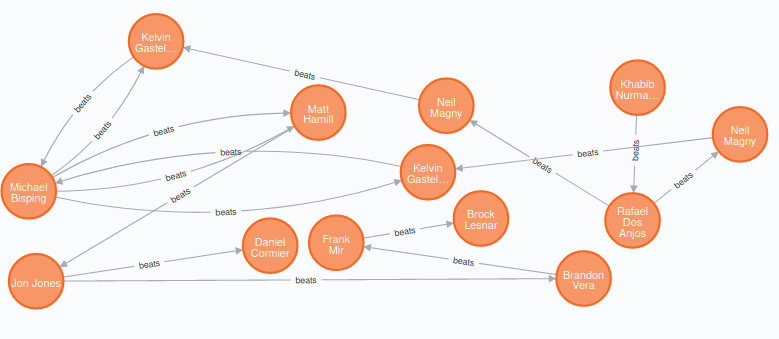

Lab 11 Report

# Lab 11 Report

## Exercise 1
```
CREATE(p:Fighter{name:"Khabib Nurmagomedov", weight:"155"}), (pp:Fighter {name:"Rafael Dos Anjos", weight:"155"}), (p)-[:beats]->(pp)
CREATE(p:Fighter{name:"Jon Jones", weight:"205"}), (pp:Fighter{name:"Daniel Cormier", weight:"205"}), (p)-[:beats]->(pp)
CREATE(p:Fighter{name:"Michael Bisping", weight:"185"}), (pp:Fighter{name:"Matt Hamill", weight:"185"}), (p)-[:beats]->(pp)
MATCH(a:Fighter) where a.name= "Rafael Dos Anjos" create (b:Fighter{name: "Neil Magny", weight: "170"}),(a)-[:beats]->(b);
MATCH(a:Fighter) where a.name= "Jon Jones" create (b:Fighter{name: "Brandon Vera", weight: "205"}),(a)-[:beats]->(b);
MATCH(a:Fighter) where a.name= "Brandon Vera" create (b:Fighter{name: "Frank Mir", weight: "230"}),(a)-[:beats]->(b);
MATCH(a:Fighter) where a.name= "Frank Mir" create (b:Fighter{name: "Brock Lesnar", weight: "230"}),(a)-[:beats]->(b);
MATCH(a:Fighter) where a.name= "Neil Magny" create (b:Fighter{name: "Kelvin Gastelum", weight: "185"}),(a)-[:beats]->(b);
MATCH(a:Fighter{name:"Kelvin Gastelum"}), (b:Fighter{name:"Michael Bisping"}) CREATE (a)-[:beats]->(b);
MATCH(a:Fighter{name:"Michael Bisping"}), (b:Fighter{name:"Matt Hamill"}) CREATE (a)-[:beats]->(b);
MATCH(a:Fighter{name:"Michael Bisping"}), (b:Fighter{name:"Kelvin Gastelum"}) CREATE (a)-[:beats]->(b);
MATCH(a:Fighter{name:"Matt Hamill"}), (b:Fighter{name:"Jon Jones"}) CREATE (a)-[:beats]->(b);
RETURN ALL FIGHTERS GRAPH
```

`match (a:Fighter) return a;`



## QUERY 1:
```
MATCH (a:Fighter)-[:beats]->(b) with a, b, count(b) as fights WHERE a.weight in ["155", "170", "185"] AND fights > 0 RETURN a;
```
## QUERY 2:
```
match (a:Fighter)-[:beats]->(b), (b)-[:beats]->(a) with a, b, count(b) as fights WHERE fights > 0 RETURN a;
```
## QUERY 3:
```
MATCH (a:Fighter)-[:beats]->(b)<-[:beats]-(c) WHERE b.name<>"Michael Bisping" RETURN a;
```
## QUERY 4.1 (ALL WINS):
```
MATCH (f:Fighter) WHERE NOT ()-[:beats]->(f) RETURN f;
```
## QUERY 4.2 (ALL LOSSES):
```
MATCH (f:Fighter) WHERE NOT (f)-[:beats]->() RETURN f;
```
## RETURN ALL RECORDS:
```MATCH (a:Fighter) RETURN a.name, a.weight;
MATCH (a:Fighter) RETURN a.name, a.weight, a.record;
```
## SET A NEW PROPERTY 'RECORD':
```
MATCH (n:Fighter{name:"Neil Magny"})
SET n.record = "This is a record"
RETURN n.name, n.record
```
